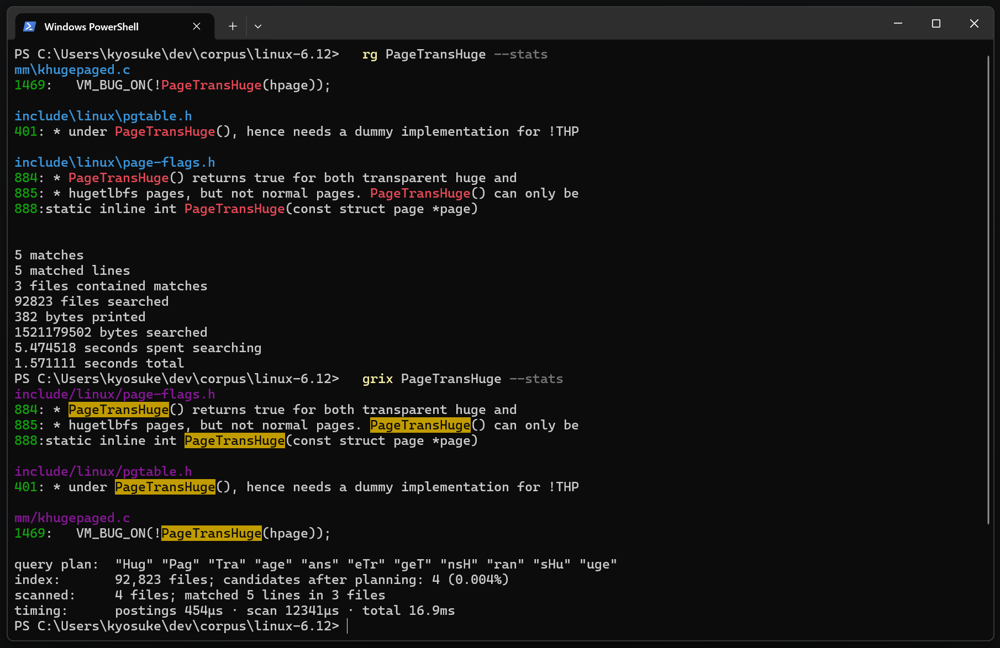

# grix

[English](README.en.md) | 日本語

grix は trigram 索引を使う grep です。

初回にディレクトリツリーの索引を作り、次回からはその索引で候補ファイルを絞って検索します。
候補ファイルには実際に regex を走らせるので、対応している範囲では ripgrep と同じ行を返します。

[](https://github.com/kyo5uke/grix/actions/workflows/ci.yml)
[](LICENSE)



## なぜ作ったか

ripgrep は速いですが、検索するたびに対象ファイルを読み直します。
小さいリポジトリなら気になりませんが、大きいツリーでは1回の検索に数秒かかることがあります。
コールドキャッシュやネットワークドライブだと、さらに待つことになります。

実際の作業では、同じツリーを何度も検索することが多いです。
リファクタリング、コードレビュー、AI コーディングエージェントなどでは、
1つのセッションで grep が何十回、何百回も走ります。
grix はそのたびに全ファイルを読む代わりに、索引から候補ファイルを引きます。

近似検索ではありません。
embedding やセマンティック検索ではなく、最後は実際のファイル内容に regex をかけて確認します。
対応している検索で grix と ripgrep の出力行が違う場合は、grix 側のバグです。
テストにも「索引あり検索とフルスキャンの結果が一致する」ことを確認する性質テストを入れています。
ベンチマークスクリプトも、両方のマッチ行数が一致しない場合は計測を止めます。

## 使い方

```bash
cargo install grix

cd your-repo
grix 'fn main'            # 初回は自動で索引を作成
grix 'fn main'            # 2回目以降は索引を使って検索
grix index                # pull 後などに増分更新
```

デーモンや設定ファイルは不要です。
モデルのダウンロードなどもありません。

索引はキャッシュディレクトリに保存します。

* Windows: `%LOCALAPPDATA%\grix`
* Linux/macOS: `~/.cache/grix`

リポジトリ内には何も書き込みません。

## ベンチマーク

Linux カーネルソース v6.12 で計測しました。
対象は 92,823 ファイル、約 1.4GB です。

環境は Windows 11、NVMe、ripgrep 15.1.0。
[`bench/run.sh`](bench/run.sh) で再現できます。
全パターンで、ripgrep と grix のマッチ行数が一致することを確認してから計測しています。

| パターン                              |   一致行数 | ripgrep |   grix |    倍率 |
| --------------------------------- | -----: | ------: | -----: | ----: |
| `PageTransHuge`（まれなリテラル）          |      5 |  2.31 s |  97 ms | 23.7× |
| `EXPORT_SYMBOL`（頻出リテラル）           | 38,267 |  2.29 s | 195 ms | 11.7× |
| `static\s+int\s+\w+_probe`（regex） | 10,081 |  2.10 s | 288 ms |  7.3× |
| `spinlock`（`-i`）                  | 17,086 |  2.23 s | 223 ms | 10.0× |
| `zzqqxx_does_not_exist`（ヒットなし）    |      0 |  2.09 s |  41 ms | 50.5× |

索引サイズは 162 MiB です。
初回構築は約 26 秒でした。
ファイルシステムキャッシュが冷えている場合は、約 90 秒かかりました。

無変更時の `grix index` は約 2.4 秒です。
その場合、ファイル内容は読み直しません。

Linux でも計測しています。
GitHub Actions の通常ランナー 4 コアでの結果です。
公開ログは[こちら](https://github.com/kyo5uke/grix/actions/runs/27286573555)です。

| パターン                              | ripgrep |   grix |    倍率 |
| --------------------------------- | ------: | -----: | ----: |
| `PageTransHuge`（まれなリテラル）          |  338 ms | 7.6 ms | 44.6× |
| `EXPORT_SYMBOL`（頻出リテラル）           |  355 ms |  63 ms |  5.6× |
| `static\s+int\s+\w+_probe`（regex） |  390 ms |  99 ms |  4.0× |
| `spinlock`（`-i`）                  |  409 ms |  71 ms |  5.8× |
| `zzqqxx_does_not_exist`（ヒットなし）    |  335 ms | 7.6 ms | 44.0× |

Windows はディレクトリ走査のコストが大きいので、環境によって差は変わります。
それでも、大きいツリーを繰り返し検索する用途ではかなり効きます。

## 仕組み

trigram は連続する3バイトです。
たとえば `hello` を含むファイルは、必ず `hel`、`ell`、`llo` を含みます。

つまり、trigram からファイル一覧を引ける索引があれば、
1GB のファイルを毎回読む代わりに、いくつかのソート済みリストを交差させるだけで候補を絞れます。

grix は regex パターンから trigram の制約を取り出します。

* `abc.*def` は `abc` AND `def`
* `abc|xyz` は `abc` OR `xyz`

この考え方は、Russ Cox による Google Code Search の trigram プランナを元にしています。

索引で絞ったファイルには、最後に本物の regex を現在の内容に対して実行します。
そのため、索引が古くても存在しない行を表示することはありません。
ただし、最近追加された行は、索引を更新するまで見落とす可能性があります。

`grix --explain` を使うと、任意のパターンがどのような trigram プランになるか確認できます。
詳しくは [ARCHITECTURE.md](ARCHITECTURE.md) に書いています。

## ripgrep 互換性

出力形式、終了コード、gitignore の扱い、バイナリ検出、行の意味論は ripgrep に合わせています。

対応している主な形式は次のとおりです。

* 通常出力: `path:line:text`
* tty でのヘッダ形式
* 終了コード: 0 / 1 / 2
* `--json`
* `--color`

フラグはまだ最小限です。

| 対応済み                                                              | 未対応                                       |
| ----------------------------------------------------------------- | ----------------------------------------- |
| `-i`, `-F`, `-l`, `-c`, `-m`, `--json`, `--no-heading`, `--color` | `-A/-B/-C`, `-U`, `-g`, `-t`, `--replace` |

対応済みの範囲で grix と ripgrep のマッチ行が食い違ったら、issue をください。

## AI コーディングエージェントで使う

AI コーディングエージェントは、同じツリーに対して何度も grep を実行します。
そのたびに全ファイルを読む代わりに grix を使わせると、検索の待ち時間をかなり減らせます。

`--json` では1行1オブジェクトの機械可読な出力を返します。
`--stats` や `--explain` を使うと、検索コストや trigram プランも確認できます。

エージェントへの指示には、たとえば次のように書けます。

```text
コード検索には grep / rg ではなく `grix <pattern>` を使うこと。
```

基本的な使い方は ripgrep に近いので、単純な検索ならそのまま置き換えられます。

## 先行プロジェクト

* [Google Code Search](https://github.com/google/codesearch): Russ Cox の trigram プランナが本プロジェクトの土台です。解説は [Regular Expression Matching with a Trigram Index](https://swtch.com/~rsc/regexp/regexp4.html)。
* [zoekt](https://github.com/sourcegraph/zoekt): サーバー型の trigram 検索エンジンです。grix はこれをローカルで、セットアップなしに使える形に寄せています。
* [qgrep](https://github.com/zeux/qgrep)、[ugrep-indexer](https://github.com/Genivia/ugrep-indexer): 索引つき grep CLI の先行例です。アーカイブ式やバッチ索引など、grix とは少し違う設計です。
* [ripgrep](https://github.com/BurntSushi/ripgrep): grix が出力や挙動を合わせる基準にしている検索ツールです。

## ライセンス

MIT